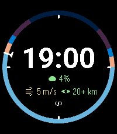
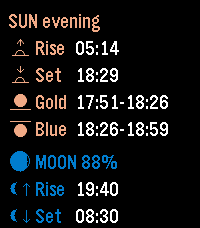
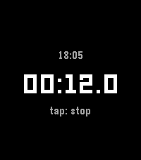
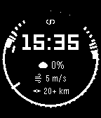
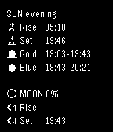
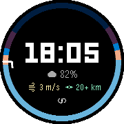
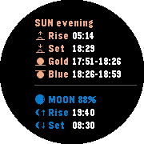

# Alpenglow

A Pebble watchface for landscape and night photography: it tells you when the light happens.

**[Install from the Pebble appstore](https://apps.repebble.com/be7ddcf0613941d1842c8310)**

<p>
  
  
  
</p>

## Screens

One gesture drives everything — a tap on the case cycles the screens.

**Clock** — the time inside a ring of the day. The ring maps 24 hours onto the circle
(midnight at the top) and colours every phase by the brightness of the sky: astronomical
night, twilight, blue hour, daytime, golden hour. A pip inside the ring marks the start of
the next light window. Below the time: cloud cover, wind and visibility, coloured by how
much they help or hinder a shot.

**Astro** — sunrise and sunset, the next golden and blue hour with their exact times,
moonrise and moonset, and the moon phase drawn from its actual illumination rather than
picked from eight stock pictures.

**Stopwatch** — a bulb timer for long exposures, reading to a tenth of a second, with an
auto-stop so a forgotten measurement does not drain the battery.

Optionally the watch vibrates a configurable number of minutes before the next light
window starts — enough lead time to reach the spot.

<details>
<summary>The same screens on a black-and-white and on a round display</summary>

<p>
  
  
</p>

Without colour the ring separates the phases by two independent cues instead: thickness
(shooting windows are full width, the backdrop of the day is a thin strip) and solid
against dashed (the brighter the phase, the denser the line). Astronomical night is the
gap in the ring.

<p>
  
  
</p>

Every row is measured against the chord of the circle at its own height, so text keeps
clear of the mask on round watches.

</details>

## How it works

The phone thinks, the watch draws. On the phone (pkjs)
[SunCalc](https://github.com/mourner/suncalc) computes the astronomy offline and
[Open-Meteo](https://open-meteo.com/) supplies cloud cover, wind and visibility — no API
key, no account. The result is packed into a compact packet of primitives; the watch
stores it, converts units and renders. That split is what keeps the watchface inside the
memory budget of the device.

Platforms: basalt, chalk, diorite, emery, flint, gabbro.

## Building

```sh
npm install
pebble build
```

Settings live on the phone, on the Clay configuration page.

## License

MIT © greenteyn
